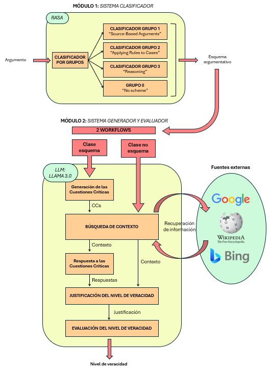

# 🛰️ Sistema: *Detectando Desinformación*

Implementación de una herramienta web para la **detección de posibles intentos de desinformación**, con el objetivo de identificar patrones argumentativos y ofrecer justificaciones basadas en fuentes externas.  

El sistema utiliza:
- **Esquemas argumentativos**: patrones de razonamiento que seguimos habitualmente los humanos.
- **Cuestiones críticas**: posibles formas de invalidar una conclusión.

De este modo, la herramienta ofrece una **justificación respaldada en diferentes fuentes** y muestra una **puntuación final** que indica el nivel de veracidad de la frase de entrada.

---

## 🧩 Arquitectura del sistema

El sistema está compuesto por varios módulos:



- **Módulo 1** → Clasificación en esquemas argumentativos (implementado con **RASA**).  
- **Módulo 2** → Generación y evaluación del nivel de veracidad del argumento de entrada, basado en **LLAMA 3** con contextualización de fuentes externas (Google, Wikipedia, Bing).  
- **Interfaz web** → desarrollada con **Streamlit**.  

---

## 🎥 Demo del sistema


---

## Uso de las claves de acceso y endpoints privados

El uso de algunas librerías requiere tener su clave de acceso, como la librería SerpAPI (utilizada en las búsquedas de Google y Bing).


### Dependencias necesarias para iniciar el sistema

Toda la instalación requerida está en el archivo: `requirements.txt`

```bash
pip install -r requirements.txt
```

### Iniciar la herramienta web

Para lanzar la web en Streamlit, con el comando:

```bash
streamlit run webapp.py
```

---

## 📚 Publicaciones

Este proyecto forma parte de los siguientes trabajos académicos y publicaciones:

- **Trabajo Final de Grado en Ingeniería Informática (UPV)**  
  Gutiérrez Mandingorra, A. (2024). *Detectando desinformación a través de técnicas de argumentación computacional y grandes modelos de lenguaje*. Universitat Politècnica de València.  
  📄 [Disponible en RiuNet](https://riunet.upv.es/handle/10251/208204)

- **Artículo en conferencia (COMMA 2024)**  
  Gutiérrez, A., Heras, S., & Palanca, J. (2024). *Detecting disinformation through computational argumentation techniques and large language models*.  
  En: Workshop on Computational Models of Natural Argument (**CMNA24**) @ **COMMA 2024**.  
  📄 [PDF en CEUR-WS](https://ceur-ws.org/Vol-3769/paper6.pdf)

  **Cita BibTeX**:
  ```bibtex
  @article{gutierrez2024detecting,
    title={Detecting disinformation through computational argumentation techniques and large language models},
    author={Guti{\'e}rrez, Ana and Heras, Stella and Palanca, Javier},
    year={2024}
  }

